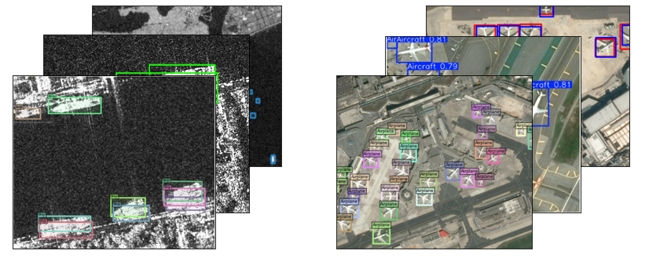
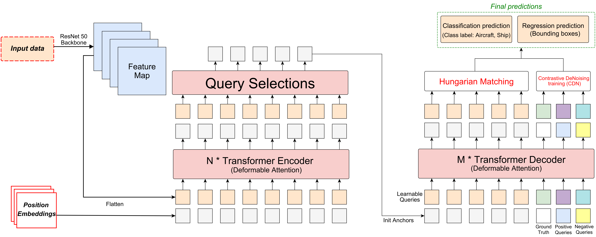

#🦖🛰️ OPT-SAR DINO Object Detection Project

This repository presents the **OPT-SAR DINO** model, designed for small-scale object detection tasks on optical and SAR images. It utilizes the following datasets:
- **Pleiades Aircraft Dataset** for optical imagery.
- **SSDD Dataset** for ship detection on SAR imagery.

## 🤖 OPT-SAR DINO model

Our **OPT-SAR DINO** model is inspired by **DINO** (*DEtection TRansformer with Improved Non-degenerate Objectives*), an advanced architecture for object detection introduced by Zhang et al. (2022). DINO improves the performance of transforming models through bipartite optimization and efficient regularization targets.

**Reference article**: [“DINO: DETR with Improved DeNoising Anchor Boxes”](https://arxiv.org/abs/2203.03605), Zhang et al., 2022.

**OPT-SAR DINO** model integrates deformable attention mechanisms to better handle objects of different scales and locations in images. It also exploits the **CDN (Conditional Denoising)** approach to improve training stability and convergence.

**OPT-SAR DINO Architecture**

## 📊 Notebooks for Benchmarking 

This repository contains benchmarking notebooks for each dataset. For both **Pleiades Aircraft Dataset** and **SSDD Dataset**, the following models are implemented:
- **OPT-SAR DINO**
- **Deformable DETR** (Zhu et al., 2021)
- **Deformable DETR** (Carion et al., 2020)
- **YOLO** (Redmon et al., 2016)
- **RetinaNet** (Lin et al., 2017)
- **Faster R-CNN** (Ren et al., 2015)

---

## 📁 Repository Structure

The proposed notebooks contain implementations of each model, our own (OPT-SAR DINO) and the other object detectors used for benchmarking. We present one notebook for each model and dataset, 12 in all.

---

## ▶️ Execution Instructions

To execute these notebooks, use **Google Colab** with a **GPU environment**. For optimal performance, it's recommended to use an **NVIDIA A100 GPU**.

---

## 🧪 Testing Phase 

The testing phase includes:
1. Visualizing predictions.
2. Calculating the following metrics:
   - **Precision**
   - **Recall**
   - **F1-Score**
   - **mAP@50**
   - **mAP@75**
   - **mAP@[0.5:0.95]**

---

## 🏆 Results
### **Pleiades Aircraft Dataset**

| Model                | Training Time (s) | Precision (%) | Recall (%) | F1-Score (%) | mAP@50 (%) | mAP@75 (%) | mAP@[0.5:0.95] (%) |
|----------------------|-----------------|-----------|--------|----------|--------|--------|--------------|
| OPT-SAR DINO    | 3099.30      | 96.65 | 94.54 | 78.49 | 98.30 | 92.27 | 78.43 |
| Deformable DETR | 3370.16      | 92.31 | 88.66 | 75.14 | 89.42 | 89.42 | 76.75 |
| DETR            | 2583.12      | 86.31 | 89.21 | 87.74 | 95.42 | 84.12 | 75.86 |
| YOLO V10        | 3750.52      | 97.34 | 76.00 | 65.36 | 80.05 | 78.46 | 73.44 |
| Faster R-CNN    | 435.22       | 81.66 | 78.97 | 73.77 | 91.61 | 73.93 | 62.53 |
| RetinaNet       | 719.46       | 74.76 | 69.56 | 55.80 | 86.75 | 78.02 | 64.54 |

### **SSDD SAR Dataset**

| Model                | Training Time (s) | Precision (%) | Recall (%) | F1-Score (%) | mAP@50 (%) | mAP@75 (%) | mAP@[0.5:0.95] (%) |
|----------------------|-----------------|-----------|--------|----------|--------|--------|--------------|
| OPT-SAR DINO    | 279.43       | 99.97 | 95.93 | 97.91 | 98.30 | 92.27 | 78.43 |
| Deformable DETR | 3370.16      | 92.96 | 86.71 | 76.75 | 89.42 | 89.42 | 76.75 |
| DETR            | 2583.12      | 90.05 | 88.46 | 73.44 | 80.05 | 78.46 | 73.44 |
| YOLO V10        | 3750.52      | 94.05 | 90.31 | 92.14 | 96.49 | 81.49 | 65.18 |
| Faster R-CNN    | 2152.24      | 90.36 | 87.23 | 88.77 | 91.61 | 73.93 | 62.53 |
| RetinaNet       | 3997.13      | 83.85 | 83.13 | 82.80 | 86.75 | 78.02 | 64.54 |
